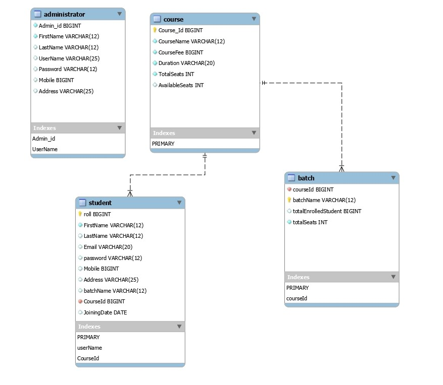
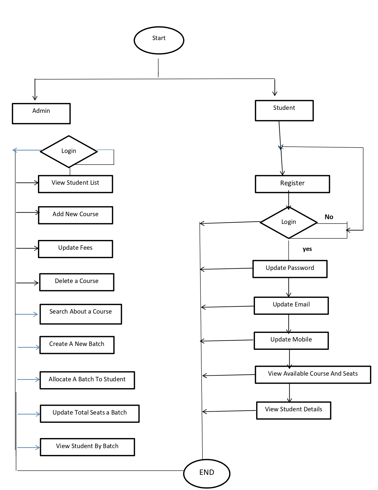

# mixed-mitten-7508
Automated Student Registration System..

<h1 align="center">Hello there, fellow DEVELOPER'S</h1>
<h3 align="center">Teamwork makes the dream work! One team, one dream.</h3>

<!-- https://www.google.com/url?sa=i&url=https%3A%2F%2Fwww.icegif.com%2Fteamwork-20%2F&psig=AOvVaw1V55uwZ46Z_ygkKyE9zEW5&ust=1668094635069000&source=images&cd=vfe&ved=0CA0QjRxqFwoTCKiExP62ofsCFQAAAAAdAAAAABAX -->

## About
   This is the backend of an online Hardware and Software Application. The user flow is implemented for 3 entities,  HOD Engineer and Employee. Employee can login registered the complain .HOD can registered the Engineer and assign to problem  to the engineer and Engineer can the solved the complain and Update the complain Status

## Tech Stack

- Java
- MySQL
- JDBC

## Modules

- Login, Logout Module
- Admin Module
- Course Module
- Student Module

## Features

- Customer and Admin authentication & validation with session uuid having.
- HOD Features:
  - Administrator Role of the entire application
  - Hod can give the access email/password given to the Engineer.
  - Only registered admins with valid session token can add/update/delete view complain list which regitered employee from main database.
- Engineer Features:
  - A Engineer can view the complain List which was assign to the Hod.
  - A Engineer can update the complain status
  - A engineer can check which complain assigned to him.  
- Employee Features:
  - A Employee can register himself or herself on the platform.
  - Employee can Registered the complaint.
   

## Project Logo

<!-- <a href="https://drive.google.com/file/d/1redTBHp9SlBXjTRZ464B-JDW7JYNphBT/view">**Video Drive Link** </a> -->
 

## Database Schema 

 
<!-- <a href="https://docs.google.com/presentation/d/1RYZl2LMi145-N6QlpuCRUKROo7vEhpJO/edit?usp=sharing&ouid=115573521711169005136&rtpof=true&sd=true">**PPT Link** </a> -->

## E-R Digram of Application 

---

 

## Contributors
👤 **Akash Yadav**

- GitHub: [@Akash1yadavv](https://github.com/Akash1yadavv)

- LinkedIn: [@Akash Yadav](https://www.linkedin.com/in/akash-yadav-83372923a/)

<!-- https://thumbs.gfycat.com/MedicalBlackandwhiteHorsechestnutleafminer-max-1mb.gif -->

##   This how we debugg

